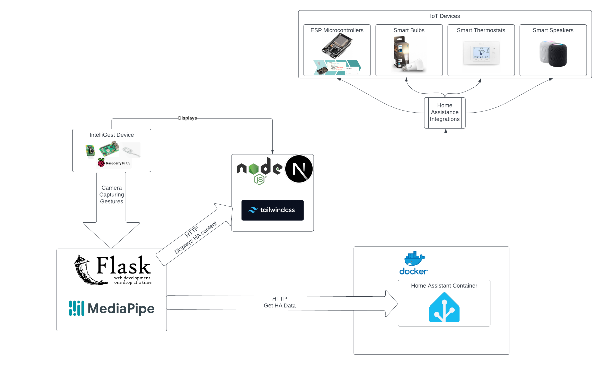

# System Block Diagram

import Figure from "../../src/components/Figure";

<Figure caption={"Figure 1. High-level design of the IntelliGest System application."}>

</Figure>

[Figure 1](../../static/img/IntelliGestSystemDiagramUpdated.png) depicts the high-level design of the product. The user will be able to set up the IntelliGest Device and connect to devices around their smart home. The device will already have Home Assistant installed along with a Flask server which will make HTTP requests to Home Assistant to GET data and then make HTTP requests to a NextJS web app to display the data in real time as the user performs actions on the system. The Flask server communicates with the Web App through Server Side Events, allowing for quick rerenders of the web page upon users actions. The Flask server is running our Mediapipe model which is used to detect the gestures the user is performing.
