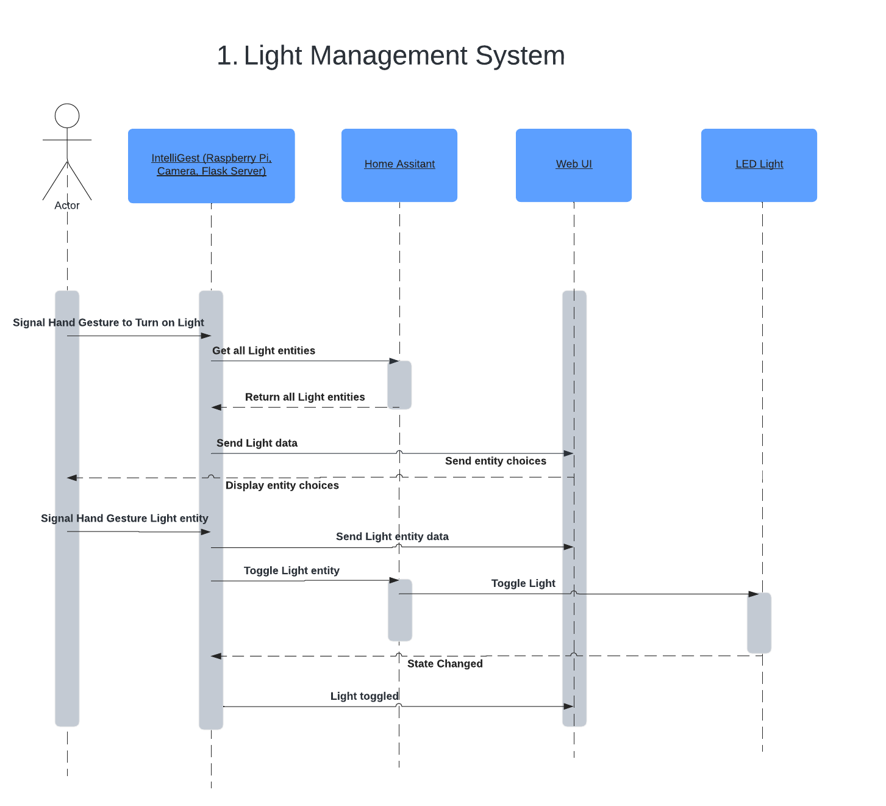
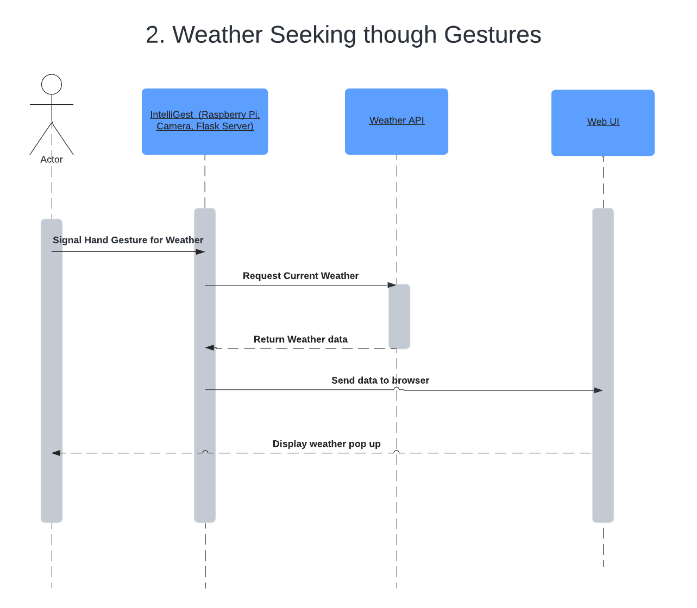
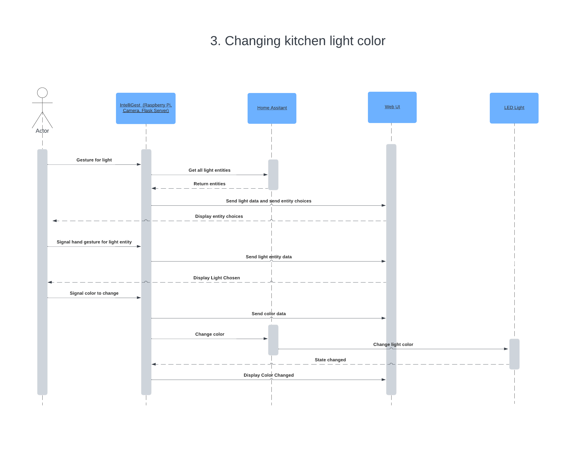
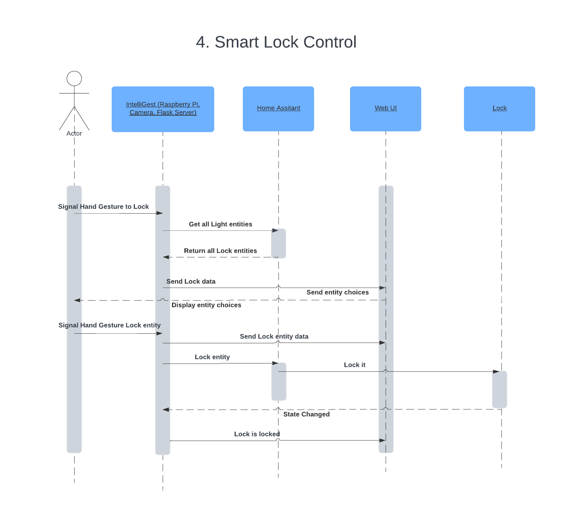
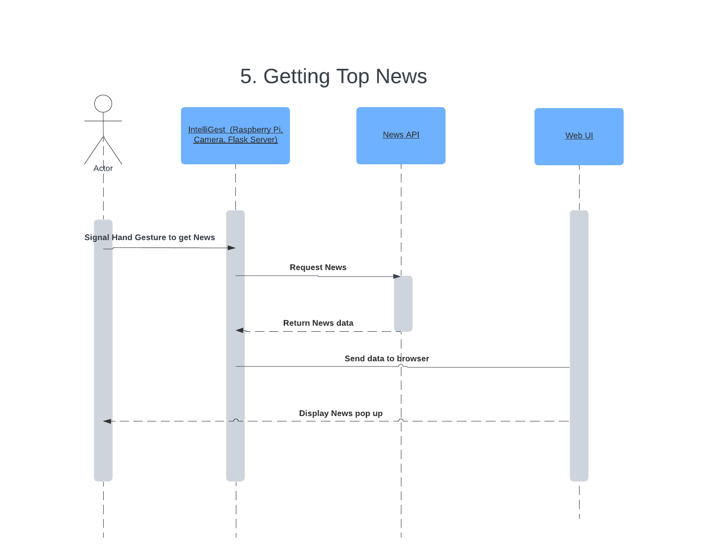
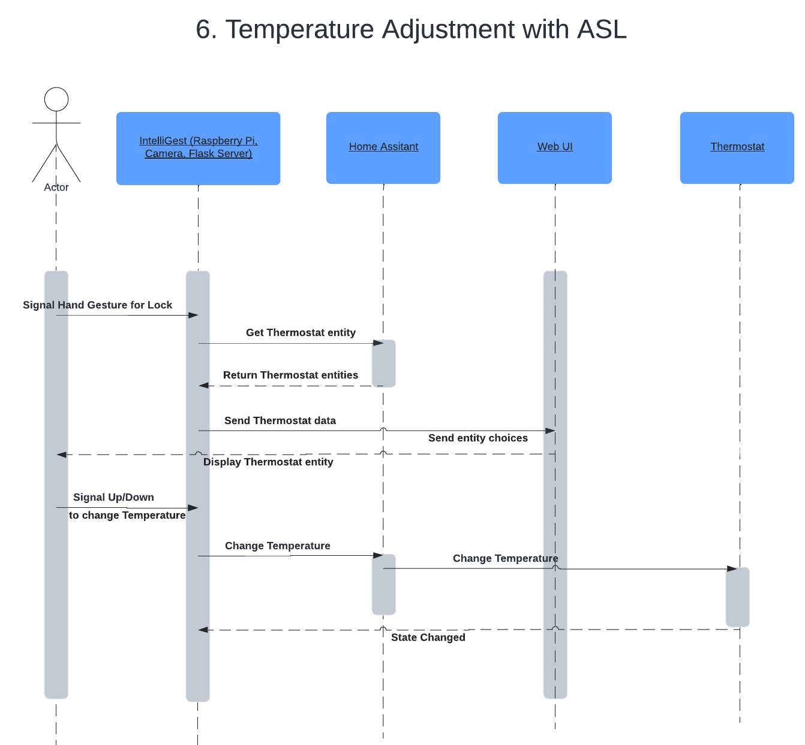
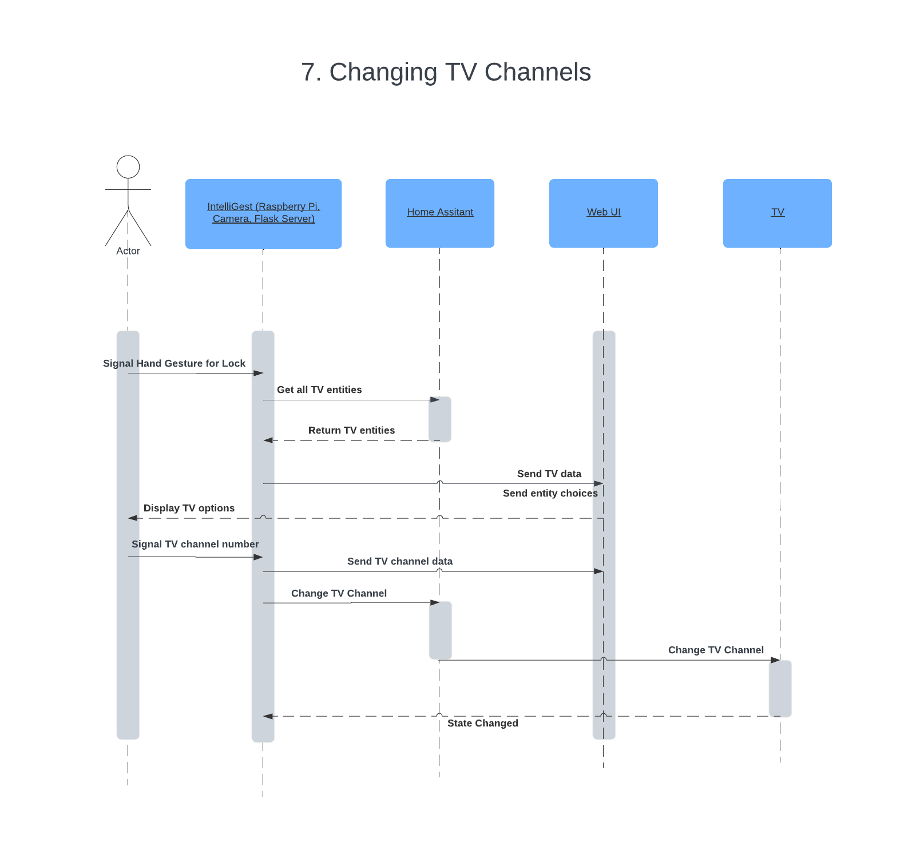

import Figure from "../../src/components/Figure";

# Sequence Diagrams

## Use Case 1: Light Control through ASL Gestures

<Figure caption={"Use Case 1. Light Control through ASL Gestures"}>

</Figure>

Scenario: an IntelliGest Home user, wants to toggle lights in different rooms using specific ASL/Gestures.
Objective: As a user, I want to swtich lights on or off in different rooms using specific ASL/gestures, so I can easily manage my home's lighting. 

1. The user performs specific gestures designated for light control.
2. Once the system detects the gesture, IntelliGest processes the input and provides immediate visual feedback.
3. Then, the light has been successfully turned on or off in different rooms. 

## Use Case 2: Weather Seeking through Gestures

<Figure caption={"Use Case 2. Weather Seeking through Gestures"}>

</Figure>

Scenario: On a Rainy day a Deaf person, is sitting on his couch in the basement and wondering if the weather is still bad weather.
Objective: As a Deaf user, I want to use gestures to seek information about the weather, so I can easily obtain this information.

1.	The user does the required gestures in front of the IntelliGest Camera.
2.	On User Interface, user sees the name of Hand gesture and Device involved in it
4.	Finally, the User sees on the display the Weather for upto next two days.

## Use Case 3: Changing Kitchen Light Color

<Figure caption={"Use Case 3. Changing Kitchen Light Color"}>

</Figure>

Scenario: A user is cooking dinner in the kitchen and wants to change the kitchen's atmosphere by adjusting the light color.
Objective: As a user, I want to change the color of my kitchen lights with gestures, to enhance my cooking experience. 

1.	The user does the required gestures in front of the IntelliGest Camera.
2.	On User Interface, user sees the name of Hand gesture and Device involved in it
3.	Finally, the User sees the kitchen light is changed to yellow by IntelliGest.

## Use Case 4: Smart Lock Setup and Control

<Figure caption={"Use Case 4. Smart Lock Setup and Control"}>

</Figure>

Scenario: A brand new user, is trying to set up a smart lock in their home for security purpose.
Objective: As a new user, I want to set up and control a smart lock with IntelliGest, ensuring my home's security.

1.	The user sets up their smart lock device.
2.	The user accesses their dashboard display.
3.	The user sets up and connects the smart lock device to IntelliGest.
4.	The smart lock should appear on the dashboard as either locked or unlocked.
5.	The user can now perform the actions mapped to unlocking and locking.

## Use Case 5: Getting the top news

<Figure caption={"Use Case 5. Adding Reminders through Gestures"}>

</Figure>

Scenario: A user wants to see the top news in the morning from their IntelliGest Smart Home. 
Objective: As a user, I want to easily view the top news.

1. The user does the required gesture in front of the IntelliGest Camera.
2. On User Interface, user sees the name of Hand gesture and Device involved in it
3. The system gets the top news and returns it to the device.
4. The top news is displayed on the dashboard

## Use Case 6: Temperature Adjustments with ASL

<Figure caption={"Use Case 6. Temperature Adjustments with ASL"}>

</Figure>

Scenario：A user wants to adjust their home temperature.
Objective: As a user, I want to adjust my home's temperature using ASL, so I can be comfortable.

1. The user starts the temperature adjustment process by performing ASL signs for hotter or colder.
2. Once detected the user gesture, IntelliGest provides feedback to acknowledge the user.
3. IntellGest processes the temperature request.
4. On User Interface, user sees the request is processing
5. Finally, the temperature has been adjusted and the system provides visual confirmation on the display.

## Use Case 7: Changing TV Channels

<Figure caption={"Use Case 7. Changing TV Channels"}>

</Figure>

Scenario: A user wants to turn on their smart TV from across the room.
Objective: As a user, I want to easily turn on my TV without the need for my remote.

1. The user performs the gestures to recognize a TV input request.
2. The user performs the action to turn on the TV.
3. IntelliGest provides feedback that it is processing their request.
4. The channel is automatically turned on by the system.
